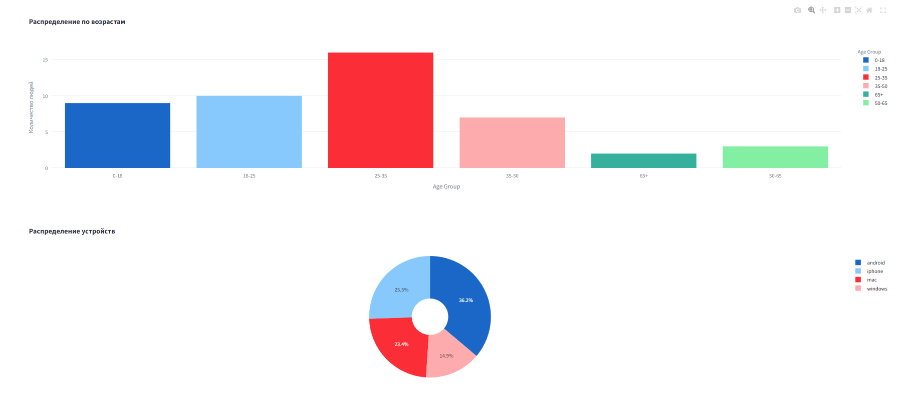
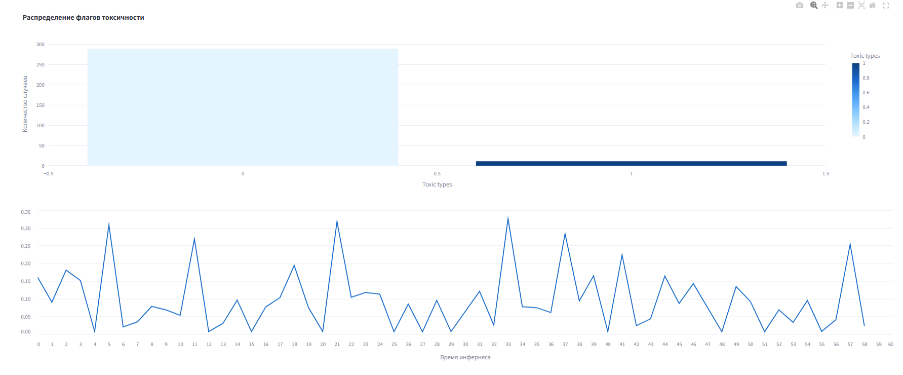
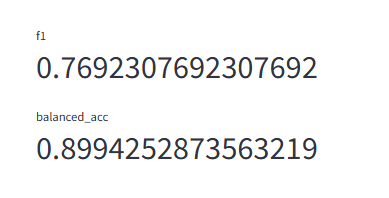

# Лабораторная работа №1 
Работу выполнил Мяков Тимофей ИАД24

## Набор данных
Используется набор данных [google/jigsaw_toxicity_pred](https://huggingface.co/datasets/google/jigsaw_toxicity_pred) <br>
Для более разнообразной визуализации были сгенерированы колонки в датасете **device** и **age**.

## ML задача
Для ML части используется pretrain модель [s-nlp/roberta_toxicity_classifier](https://huggingface.co/s-nlp/roberta_toxicity_classifier)

## Структура проекта
```bash
.
├── venv/                     
├── data/                    
│   └── train_augmented.csv   # Аугментированные данные 
├── img/                      
├── src/
│   ├── config.yaml           # Конфиги топиков и продюсеров/консьюмеров
│   ├── analysis.py           # Скрипт с классом инференса ML модели
│   ├── extraction.py         # Скрипт с загрузкой сырых данных в кафку
│   └── processing.py         # Скрипт с препроцессингом (токенизацией) сырых данных
├── app.py                    # Приложение на streamlit с визулизацией
└── docker-compose.yaml       # Конфигурация Docker
```

## Визуализация
Визуализация выполнена на streamlit:
- Анализ сырых данных <figure></figure>

- Анализ инференса модели <figure></figure>

- Метрики качества модели <figure></figure>

## Запуск
- Скачайте docker образ kafka: `docker pull bitnami/kafka` и образ zookeeper: `docker pull bitnami/zookeeper`
- `pip install -r requirements.txt`
- `docker-compose up -d`
- Запуск скриптов в приведенном порядке в разных терминалах:
```
python src/extraction.py 
python src/processing.py
python src/analysis.py
streamlit run app/app.py
```
