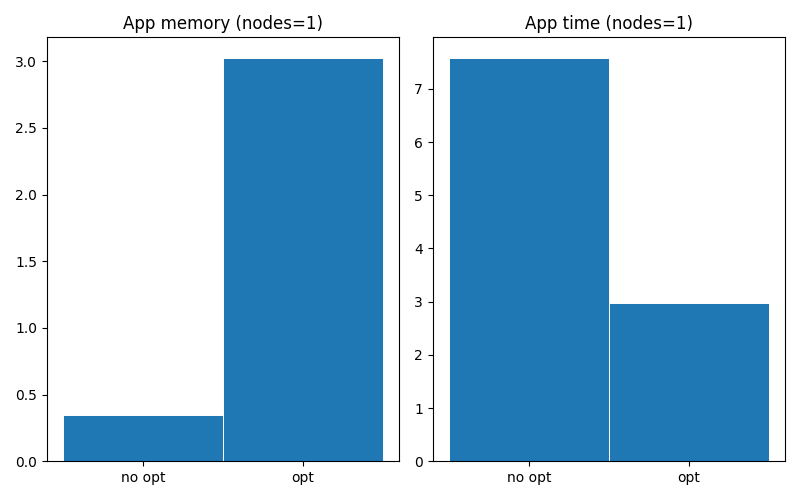
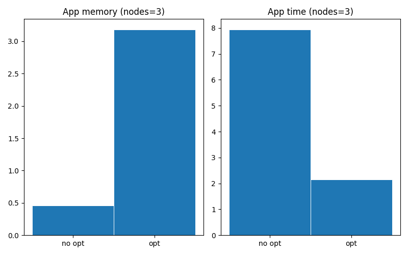

# Lab2 Hadoop + Spark
Мяков Тимофей ИАД24

## Описание
Для лабораторнрой работы использовали образы: 
 - bde2020/hadoop-datanode:2.0.0-hadoop3.2.1-java8
 - bitnami/spark:latest

Датасет: [The AI, ML, Data Science Salary (2020- 2025)](https://www.kaggle.com/datasets/samithsachidanandan/the-global-ai-ml-data-science-salary-for-2025)

P.S В изначальном датасете 85000 строк, поэтому я его искусственно расширил до 150000 строк.

Оптимизированная часть в ```spark_app``` (72 строка):
```python
if optimized: #оптимизация с repartition и cache
    filtered_df = filtered_df.repartition(
        8, "work_year", "experience_level"
    )
    filtered_df.cache()
    _ = filtered_df.count()
```

## Запуск 

### 1 DataNode
```bash
docker-compose -f docker-compose-1node.yml up -d
```
### 3 DataNode
```bash
docker-compose -f docker-compose-3node.yml up -d
```

## Dataset
```bash
docker cp data/salaries.csv namenode:/
docker cp -L src/. spark-master:/opt/bitnami/spark/

docker exec -it namenode bash
hdfs dfs -put salaries.csv /
exit
```


## Experiments

### 1 DataNodes

```bash
docker exec -it spark-master spark-submit --master spark://spark-master:7077 spark_app.py -pth hdfs://namenode:9000/salaries.csv -n 1

docker cp spark-master:/opt/bitnami/spark/app_metrics_1nodes.png images
```



### 3 DataNodes

For general run use the following command
```bash
docker exec -it spark-master spark-submit --master spark://spark-master:7077 spark_app.py -pth hdfs://namenode:9000/salaries.csv -n 3

docker cp spark-master:/opt/bitnami/spark/app_metrics_3nodes.png images
```




## Выключение
### 1 DataNodes
```bash
docker-compose -f docker-compose-1node.yml down
```

### 3 DataNodes
```bash
docker-compose -f docker-compose-3node.yml down
```