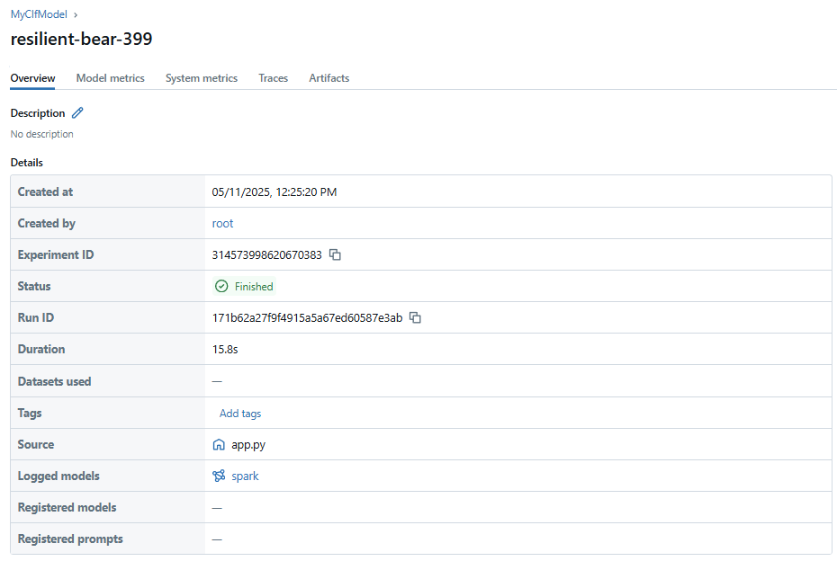
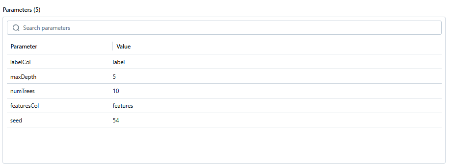
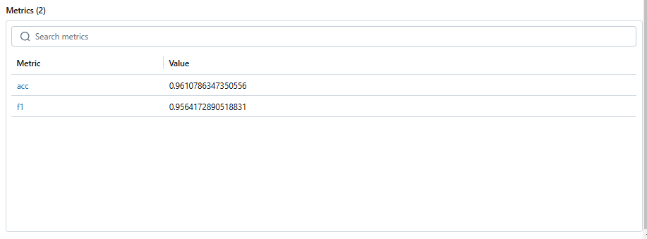

# Lab2 Spark + DataLake + MlFlow
Мяков Тимофей ИАД24

## Запуск 
```bash
docker-compose down #если перезапускаешь 
docker-compose build
docker-compose up
```


## Датасет
Датасет взят [отсюда](https://github.com/akmand/datasets/blob/main/baseball.csv) и аугментирован до нужных размеров (100000+ строк). 


## Результаты экспериментов

Общая инфа по эксперименту


Залогрированы параметры RandomForestClf


Залогированы метрики на валидационной выборке
